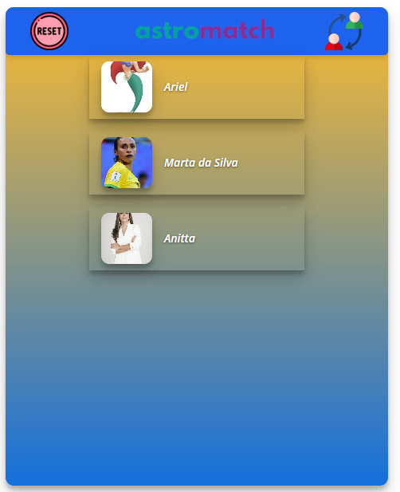

# Projeto:
Site AstroMatch

# Link do Surge:
https://astromatch-marleo.surge.sh/

# Descrição:
O site AstroMatch simula um aplicativo de paquera, semelhante ao conhecido app Tinder.

## O que funciona:
Passar pra próxima pessoa, tanto dando like quanto dando dislike;
Renderizar uma lista de matches;
Botão para resetar a lista de matches;
Botão para alternar entre a tela inicial para a tela de lista de matches e vice-versa.

## O que não funciona:
Um alerta dizendo que deu match

## Observação do código:
Sei que não é uma boa prática deixar o código comentado, porem este projeto foi de grande dificuldades para mim, e optei por comentar e deixar comentado todo ele para eu conseguir gravar o que faz cada coisa no código.

# Tecnologias utilizadas:

# Autor:
Márleo Piber da Rosa;

  
# Imagens:
####Tela inicial:

####Tela de matches:
